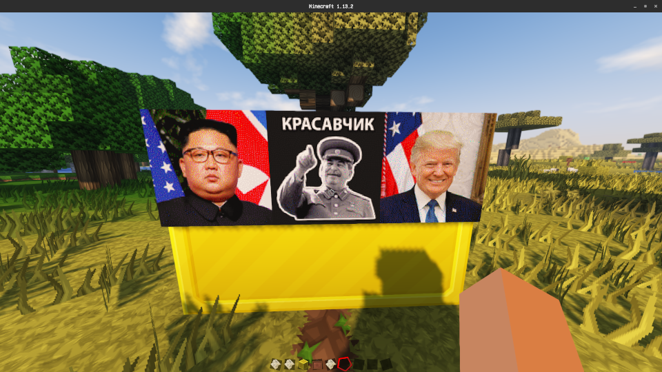

# Minemap

Command line utilities for manipulating Minecraft Map item so that we can have this in Minecraft:

This repository contains two command line utilities, "minemap" to convert images to map items, the other "pamenim" to do the reverse. Run the utilities themselves with no arguments to view usage information.

Building is handled by CMake. As of version 0.4.0, boost is no longer required neither at compile time and run time. Please make sure you have the following dependencies:

* Magick++ 7, part of Imagemagick
* zlib, used to compress / decompress NBT data stream
* nbtp, used to manipulate NBT data structure (included as a git submodule)

Prior to building, please run `git submodule update --init --recursive`.

### [Update Needed for 0.4.0] Building on Windows...

Without loss of generality, let's admit that building this on Windows is the worst part for me, and probably for readers as well. To save the hassle you may download prebuilt, statically linked executables from the release page. For fearless Windows users who prefer to build yourself out there, follow me (or even better, improve the following as I have no idea how Visual Studio should really work):

1. Clone libnbtp, load the solution with visual studio, build the library, and take a note of where the compiled nbtp static object, say `C:\Users\john\nbtp\x64\Release\nbtp.lib`
2. Follow [ImageMagick documentation](https://imagemagick.org/script/install-source.php) to build ImageMagick static libraries. Take a note of the output directory, say `C:\Users\john\ImageMagick-Windows\VisualMagick\lib`. You should see a bunch of `CORE_something.lib` files in that directory.
3. Load minemap.sln. For each of the VC project, change the following project properties:
   - VC++ Directories -> Include Directories: add path to ImageMagick installataion, add path to libnbtp include directory.
   - C/C++ -> Code Generation -> Runtime Library: change to "Multi-threaded DLL" if you would prefer to link dynamically.
   - Linker -> Input -> Additional Depencencies: add path in step 2 and step 1.
4. Build solution.
