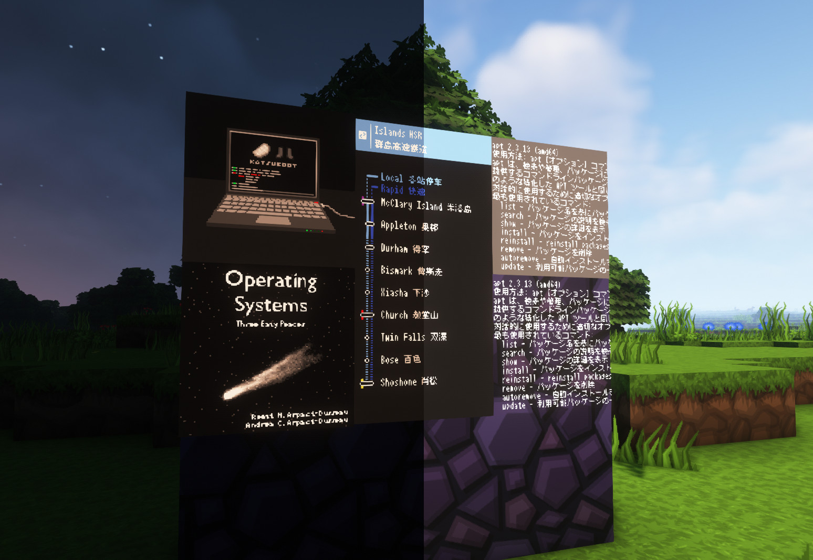

# Minemap

Command line utilities for manipulating Minecraft Map item so that we can have this in Minecraft:



This repository contains two command line utilities, "minemap" to convert images to map items, the other "pamenim" to do the reverse. Run the utilities themselves with no arguments to view usage information and supported minecraft versions.

Building is handled by CMake. As of version 0.4.0, boost is no longer required neither at compile time nor run time. Please make sure you have the following dependencies:

* Magick++ 7, part of Imagemagick, OR GraphicsMagick if you are building on Windows or a platform that doesn't have ImageMagick.
* zlib, used to compress / decompress NBT data stream
* nbtp, used to manipulate NBT data structure (as a git submodule or use existing library)

If you want to build with NBTP in the submodule, please run `git submodule update --init --recursive` prior to building.

### Technical Details

View README-minecraft.md for a detailed explanation on map item formats. See `misc` for color tables used in different minecraft versions.

### Building on Windows ft. @liushuyu

I have no idea how to build minemap on that shit. Luckily @liushuyu found a way to do this. Starting from v0.4.4, you may download prebuilt, statically linked executables from the release page.

It's dangerous to go alone! Take these steps to compile your own copy on Windows.

##### Prepare

1. Install MinGW64 with [MSYS2](https://www.msys2.org/), and launch into a MINGW64 prompt.
2. Install the following list of dependencies with `pacman -S <packages>`:
    - `git`
    - `mingw-w64-x86_64-toolchain`
    - `mingw-w64-x86_64-cmake`
    - `mingw-w64-x86_64-ninja`
3. Clone [vcpkg](https://github.com/microsoft/vcpkg) to say `/home/user/vcpkg`, run their bootstrap batch file. You should find a `vcpkg.exe` in `vcpkg` repo directory.
4. Set environment variable in your MinGW64 prompt:
    - export VCPKG_DEFAULT_TRIPLET=x64-mingw-static
    - export VCPKG_DEFAULT_HOST_TRIPLET=x64-mingw-static
5. Install the following dependencies with `./vcpkg.exe install <packages>`:
    - `fmt`
    - `zlib`
    - `jbigkit`
    - `graphicsmagick`
6. Go to `/home/user/vcpkg/ports/graphicsmagick`, and apply this patch:
```diff
diff --git a/CMakeLists.txt b/CMakeLists.txt
index 7e6be2992..9f0edcb00 100644
--- a/CMakeLists.txt
+++ b/CMakeLists.txt
@@ -12,6 +12,8 @@ add_definitions(-D_MAGICKLIB_ -D_WANDLIB_ -DMAGICK_IMPLEMENTATION)
 
 if (BUILD_SHARED_LIBS)
     add_definitions(-D_DLL -DDLL)
+else ()
+    add_definitions(-D_LIB)
 endif ()
 
 if (MSVC)
```
7. Back out and reinstall `graphicsmagick`:
    - `./vcpkg.exe remove graphicsmagick`
    - `./vcpkg.exe install graphicsmagick`

##### Actual building

1. Clone this repository and checkout to a desired revision, run `git submodule init` and `git submodule update`.
2. Create a build directory. From here use cmake to configure the build:
```
cmake .. -DCMAKE_BUILD_TYPE=Release \
         -DSYSTEM_NBTP=OFF \
         -DUSE_GRPHICSMAGICK=ON \
         -DCMAKE_TOOLCHAIN_FILE=/home/user/vcpkg/scripts/buildsystems/vcpkg.cmake
         -DVCPKG_TARGET_TRIPLET=x64-mingw-static
```
3. Run ninja to build.
4. Run `cmake --install . --prefix <destdir>` to install to `<destdir>`.
